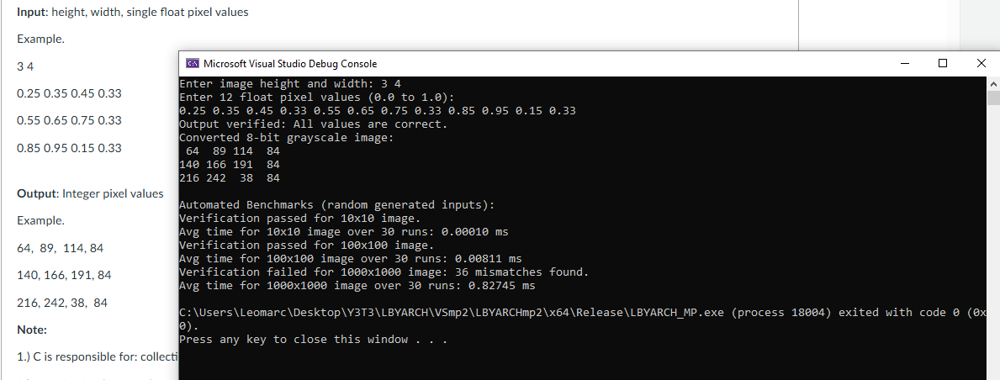

# LBYARCH-MP2: Grayscale Conversion in C & x86 Assembly

## Project Overview

This project is an implementation of a grayscale image conversion utility that transforms a single-precision float representation (values from 0.0 to 1.0) into an 8-bit unsigned integer representation (values from 0 to 255). The conversion logic is written in x86-64 assembly language and is called from a C host program responsible for handling I/O and benchmarking.

## Custom Conversion Rule

The primary challenge of this project was due to the given example input and output.
There was not a consistent rounding method we cold employ in order to properly follow the problem specifications.
If we chose **TRUNCATION**, then 0.25 x 255 = 63.75 ---> does not make sense to become 64.
If we chose **ROUNDING**, then 0.45 x 255 = 144.75 ---> does not make sense to become 144.

THE FINAL CONVERSION ALGORITHM we decided to do is Truncation but with a specific rule when the fractional part is somewhere within .75.

1.  Calculate the initial value first, so `v = float_pixel * 255.0` in C.
2.  The default conversion is then used with **truncation** (rounding down). CVTTSS2SI in Assembly.
3.  **0.75 CASE**: If `v` has a fractional part of exactly **0.75** AND its integer part is **odd**, the value must be **rounded up** instead.

## Sample Runs & Output

Here are the results from three separate executions of the program. Note that the manual 3x4 test case passes consistently, but the results for the larger, randomly generated benchmarks vary slightly with each run.

_Figure 1: First benchmark run showing 36 mismatches for the 1000x1000 image._

_Figure 2: Second run showing 1 mismatch for the 100x100 image and 32 for the 1000x1000 image._

_Figure 3: Third run showing 27 mismatches for the 1000x1000 image._

## Analysis of Benchmark Results

The main observation we can have from the benchmarks is that the small number of "mismatches" that appear in the tests for larger images. This behavior is not a random bug but an issue with **floating-point precision**.

* **The C Verification Code:** The `custom_convert` function in C is robust. It checks if the fractional part is *within a small range* of 0.75 (i.e., `> 0.749f && < 0.751f`). This allows it to correctly handle values that are extremely close to 0.75, such as `0.74999999`.

* **The Assembly Implementation:** The assembly code, however, performs a *strict, exact comparison*. It checks if the fractional part is identical to `0.75` and will not consider `0.74999999` a match.

The number of mismatches changes with each run because the input data is randomly generated, altering the probability of encountering these specific edge-case values.
